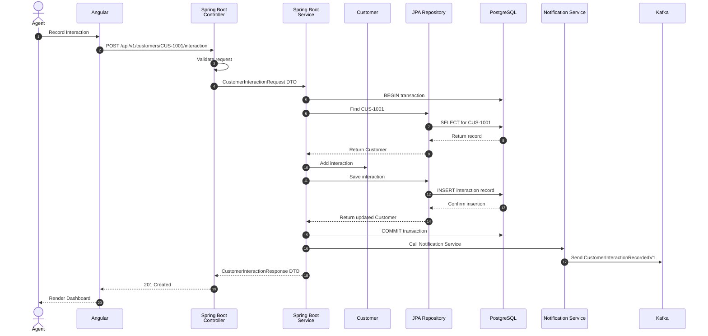
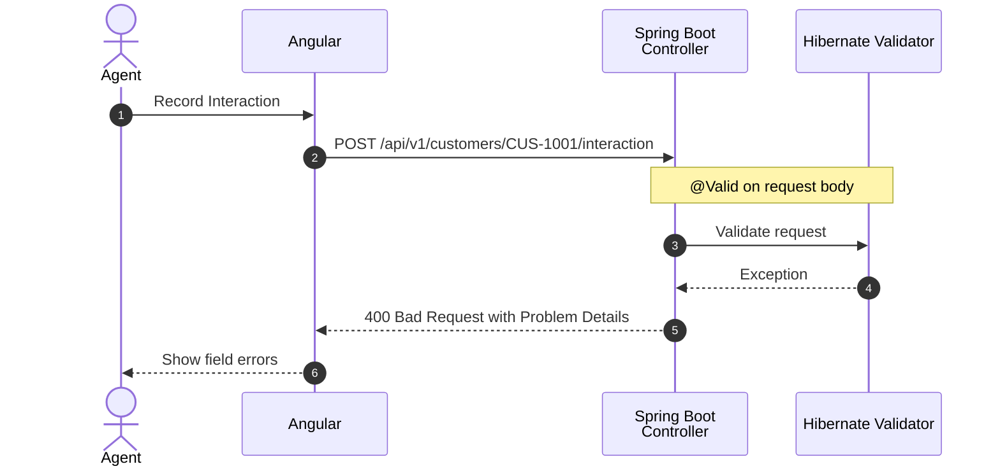
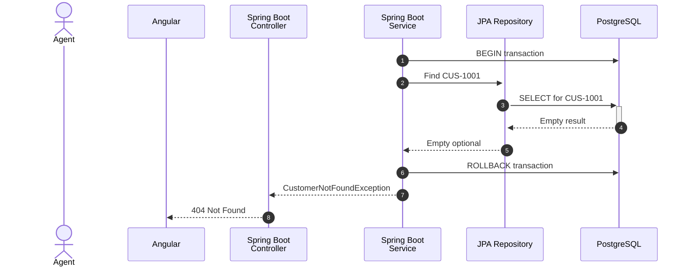
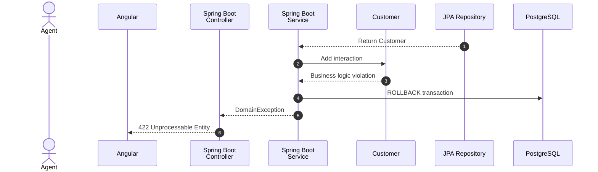
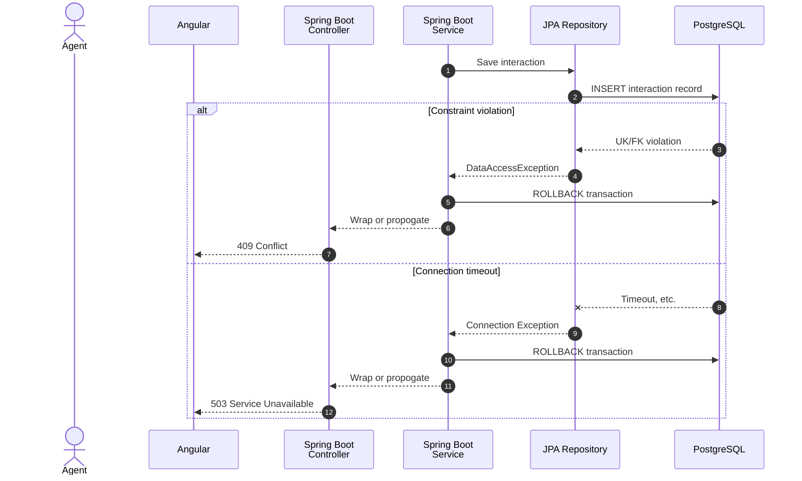
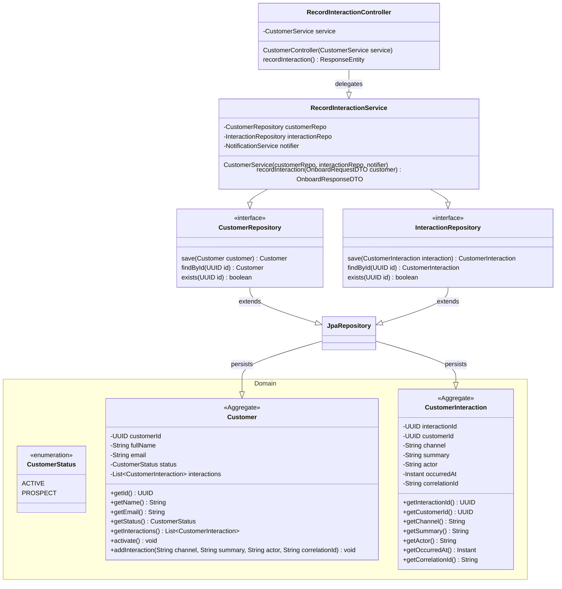

# Application Diagrams

### Application Flow

#### Record Customer Interaction: Happy Path

#### Validation Error Path

#### Customer Not Found Error Path

#### Business Logic Violation Error Path

#### Persistence Error Path

### RecordCustomerInteraction UML Diagram

