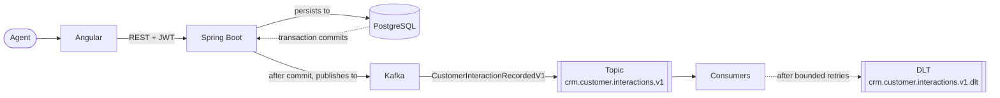
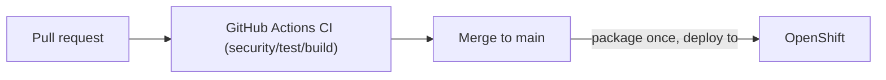

# Northstar CRM Architecture
Northstar CRM is a slice of a customer management platform for a bank's service agents: an agent searches a customer, reads the profile, and records an interaction.

## Stack

| Layer | Choice |
| --- | --- |
| Frontend | Angular 21, Node 22 LTS, TypeScript |
| API | Spring Boot 4.1.1 on Java 21 |
| Persistence | PostgreSQL 16, Spring Data JPA, Flyway |
| Messaging | Apache Kafka 3.9 |
| Runtime | OpenShift |
| CI/CD | GitHub Actions |
| Infrastructure | Terraform, Ansible |

## Non-goals

- Bitbucket Pipelines 
- Oracle 
- React 
- SOAP 
- k3s 

## Fixtures

| ID | Meaning |
| --- | --- |
| `CUS-1001` | Amina Khan, amina.khan@example.com, ACTIVE |
| `CUS-1002` | Ravi Singh, ravi.singh@example.com, PROSPECT |
| `CUS-9999` | None existent customer |
| `lab-request-001` | Correlation ID |

## Runtime path

## Delivery path

