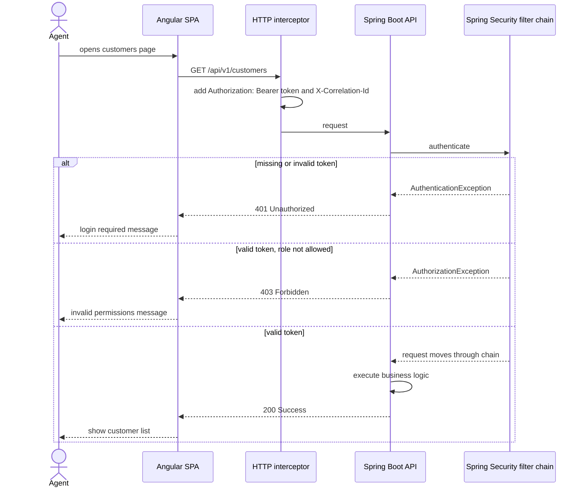

# Security Diagram

### JWT: Authentication and Authorization

```mermaid
sequenceDiagram
  actor A as Agent
  participant UI as Angular SPA
  participant I as HTTP interceptor
  participant API as Spring Boot API
  participant S as Spring Security filter chain
  A->>UI: opens customers page
  UI->>I: GET /api/v1/customers
  I->>I: add Authorization: Bearer token and X-Correlation-Id
  I->>API: request
  API->>S: authenticate
  alt missing or invalid token
    S-->>API: AuthenticationException
    API-->>UI: 401 Unauthorized
    UI-->>A: login required message
  else valid token, role not allowed
    S-->>API: AuthorizationException
    API-->>UI: 403 Forbidden
    UI-->>A: invalid permissions message
  else valid token
    S-->>API: request moves through chain
    API->>API: execute business logic
    API-->>UI: 200 Success
    UI-->>A: show customer list
  end
```