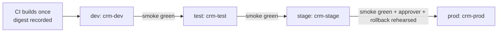

# Environment strategy

## Rules
1. **Promotions.** Promotions use digests from GH Actions, nothing is rebuilt per environment. Local developer builds are not a release identity.
2. **Synthetic Data.** Only synthetic data (fixtures `CUS-1001`, `CUS-1002`) is used in every environment below `prod`.

## Environments

| Env | OpenShift Project | GitHub Environment | Approvals | Config source |
| --- | --- | --- | --- | --- |
| dev | `crm-dev` | `dev` | Optional | local ConfigMap/Secret |
| test | `crm-test` | `test` | Optional | ConfigMap in `test.yaml`/GH Environment secrets |
| stage | `crm-stage` | `stage` | Required: a reviewer who did not start the run | ConfigMap (`stage.yaml`)/GH Secret |
| prod | `crm-prod` | `prod` | Required: a reviewer who did not start the run | ConfigMap (`prod.yaml`)/GH Secret |

## Promotion gates 

| From → to | Evidence required | Approver |
| --- | --- | --- |
| build → dev | Required checks green | Release owner or backup approves the deploy that the `v*` tag started |
| dev → test | Green smoke test in dev | Release owner |
| test → stage | Green smoke test in test; integration test pass; no open High or Critical findings | A second member |
| stage → prod-like | Green smoke test in stage; named approver; rollback command rehearsed once in a lower environment with the run link | A second member, who did not start the run |
